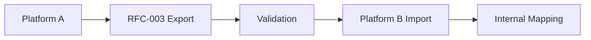

# RFC-003: Muscle Data Model Specification

**Status**: Draft  
**Version**: 0.1.0  
**Date**: 2025-09-09  
**Authors**: VITNESS Team  
**Category**: Standards Track  

## Abstract

This specification defines a standardized data model for muscle information to enable interoperability and data portability across fitness applications and platforms. This RFC establishes the structural requirements for muscle data while allowing platforms to maintain their own anatomical classifications and muscle taxonomies.

## 1. Introduction

### 1.1. Background

Fitness applications require consistent muscle definitions for exercise targeting, workout programming, and progress tracking. Currently, each platform maintains separate muscle taxonomies and anatomical classifications, creating data fragmentation and limiting interoperability.

### 1.2. Goals

This specification aims to:
1. Define structural requirements for muscle data interchange
2. Enable seamless muscle data migration between fitness applications
3. Support platform-specific anatomical attributes through extension mechanisms
4. Establish consistent muscle identification and classification patterns
5. Provide reference JSON Schema implementation for validation

### 1.3. Scope

**In Scope:**
- Core muscle data structure and required fields
- Muscle classification including regional and laterality information
- Extension mechanisms for platform-specific anatomical data
- JSON Schema definitions and validation rules
- Muscle media and documentation references
- Internationalization support for muscle names

**Out of Scope:**
- Specific anatomical taxonomies or medical classifications
- Biomechanical analysis and muscle activation patterns (future RFC)
- Injury and rehabilitation data
- Real-time muscle activation measurement

## 2. Terminology

- **Muscle**: Anatomical contractile tissue that generates force and produces movement
- **Canonical Data**: Standardized identifying information (name, slug, aliases)
- **Classification**: Anatomical categorization data (category, region, laterality)
- **Region**: Anatomical location grouping (upper-front, lower-back, etc.)
- **Laterality**: Symmetry characteristic (bilateral, unilateral, left, right)
- **Extension**: Platform-specific data that doesn't break interoperability
- **Schema Version**: Semantic version indicating data model compatibility

## 3. Core Structural Requirements

### 3.1. Required Fields

All compliant muscle data MUST include these fields:

```json
{
  "schemaVersion": "1.0.0",
  "id": "mus.quadriceps",
  "canonical": {
    "name": "Quadriceps",
    "slug": "quadriceps"
  },
  "classification": {
    "categoryId": "cat.legs",
    "region": "lower-front"
  },
  "metadata": {
    "createdAt": "2025-01-01T00:00:00Z",
    "updatedAt": "2025-09-03T00:00:00Z",
    "source": "vitness.registry",
    "status": "active"
  }
}
```

### 3.2. Optional Standard Fields

Commonly supported optional fields that enhance interoperability:

```json
{
  "canonical": {
    "aliases": ["Quads"],
    "localized": [
      { "lang": "sr", "name": "Kvadriceps" }
    ]
  },
  "classification": {
    "laterality": "bilateral",
    "tags": ["major-muscle", "lower-body"]
  },
  "heatmap": {
    "atlasId": "atlas.body.v1",
    "regions": [
      { "areaId": "thigh.left.anterior", "weight": 1.0 },
      { "areaId": "thigh.right.anterior", "weight": 1.0 }
    ]
  },
  "media": [],
  "attributes": {
    "fiberType": "mixed",
    "size": "large",
    "function": "knee-extension"
  }
}
```

### 3.3. Extension Mechanisms

Two extension points for platform-specific data:

#### 3.3.1. Attributes (Structured Extensions)
For common extensions that may become standardized:
```json
{
  "attributes": {
    "fiberType": "mixed",
    "size": "large",
    "function": "knee-extension"
  }
}
```

#### 3.3.2. Extensions (Platform-Specific)
For complex platform-unique data structures:
```json
{
  "extensions": {
    "x:anatomy": {
      "origin": "Anterior superior iliac spine, femur",
      "insertion": "Patella, tibial tuberosity",
      "innervation": "Femoral nerve"
    }
  }
}
```

## 4. Reference Types and Structures

### 4.1. Canonical Information
```json
{
  "canonical": {
    "name": "Quadriceps",
    "slug": "quadriceps",
    "aliases": ["Quads"],
    "localized": [
      { "lang": "sr", "name": "Kvadriceps" }
    ]
  }
}
```

### 4.2. Classification Structure
```json
{
  "classification": {
    "categoryId": "cat.legs",
    "region": "lower-front",
    "laterality": "bilateral",
    "tags": ["major-muscle", "lower-body"]
  }
}
```

### 4.3. Regional Classification

The `region` field follows standardized anatomical regions:
- **upper-front**: Chest, front deltoids, biceps
- **upper-back**: Lats, rear deltoids, rhomboids, traps
- **lower-front**: Quadriceps, hip flexors
- **lower-back**: Hamstrings, glutes, erector spinae
- **core**: Abdominals, obliques, transverse abdominis
- **full-body**: Muscles that span multiple regions
- **n/a**: Non-applicable or undefined regional classification

### 4.4. Laterality Classification

The `laterality` field describes symmetry characteristics:
- **bilateral**: Muscle exists on both sides of the body symmetrically
- **unilateral**: Muscle exists on one side only
- **left**: Specific left-side muscle
- **right**: Specific right-side muscle
- **n/a**: Not applicable or midline muscles

### 4.5. Media References
```json
{
  "media": [
    {
      "type": "image",
      "uri": "https://cdn.example.com/anatomy/quadriceps.jpg"
    }
  ]
}
```

### 4.6. Heatmap via Body Atlas

Muscle records MAY include an optional `heatmap` object referencing a Body Atlas. A Body Atlas defines views (e.g., anterior/posterior) and named areas bound to shapes within an asset (typically SVG). Muscles reference these areas with intensity weights to enable interoperable visualization.

Structure:
```json
{
  "heatmap": {
    "atlasId": "atlas.body.v1",
    "regions": [
      { "areaId": "thigh.left.anterior", "weight": 1.0 },
      { "areaId": "thigh.right.anterior", "weight": 1.0 }
    ]
  }
}
```

Notes:
- `atlasId` references an Atlas item (see Body Atlas schema) and SHOULD be a UUID in production datasets.
- `areaId` MUST correspond to an `areas[*].id` within the referenced Atlas.
- `weight` is `0..1` and represents relative intensity/coverage; default `1.0`.
- Consumers SHOULD clamp weights to `[0,1]` and map them to color/opacity scales as appropriate.

## 5. Versioning and Compatibility

### 5.1. Schema Versioning

Following semantic versioning:
- **Major**: Breaking changes to required fields
- **Minor**: New optional fields or enum values
- **Patch**: Documentation, validation updates

### 5.2. Compatibility Rules

- All data valid in version X.Y.Z must remain valid in X.Y+1.0
- New required fields must provide sensible defaults
- Deprecated fields remain functional for entire major version
- Migration paths must be documented for major version changes

### 5.3. Schema Evolution Example

Version 1.0.0 → 1.1.0 (Adding optional biomechanical field):
```json
{
  "schemaVersion": "1.1.0",
  "id": "mus.quadriceps",
  "canonical": { "name": "Quadriceps", "slug": "quadriceps" },
  "biomechanics": {
    "primaryActions": ["knee-extension", "hip-flexion"],
    "forceDirection": "linear"
  }
}
```

## 6. Implementation Guidance

### 6.1. Platform Integration

Platforms implementing this standard should:

1. **Maintain Internal Models**: Keep existing muscle catalogs and anatomical classifications
2. **Export Compliance**: Provide muscle data in RFC-003 format for portability
3. **Import Translation**: Map incoming RFC-003 data to internal structures
4. **Extension Usage**: Use `extensions` namespace for platform-specific data

### 6.2. Data Migration Workflow



1. Source platform exports muscles in RFC-003 format
2. Data validation against JSON Schema
3. Target platform imports and maps to internal model
4. Custom extensions handled based on platform capabilities

## 7. Security and Privacy Considerations

- This specification defines data format only
- Implementations must validate against JSON Schema
- User-generated content in extensions should be sanitized
- Follow standard security practices for data transmission

## 8. JSON Schema Reference

Complete JSON Schema available at:
- **Muscle**: `/specification/schemas/muscle/v.1.0.0/muscle.schema.json`
- **Body Atlas**: `/specification/schemas/atlas/v1.0.0/body-atlas.schema.json`

## 8.1. Validation

Validate with Ajv (Draft 2020-12):

```
npx ajv -s specification/schemas/muscle/v.1.0.0/muscle.schema.json \
  -d specification/schemas/muscle/v.1.0.0/muscle.example.json
```

## 9. Example Implementation

### 9.1. Complete Quadriceps Muscle Record

Based on reference implementation (`/specification/schemas/muscle/v.1.0.0/muscle.example.json`):

```json
{
  "schemaVersion": "1.0.0",
  "id": "mus.quadriceps",
  "canonical": { 
    "name": "Quadriceps", 
    "slug": "quadriceps",
    "aliases": ["Quads"],
    "localized": [
      { "lang": "sr", "name": "Kvadriceps" }
    ]
  },
  "classification": { 
    "categoryId": "cat.legs", 
    "region": "lower-front", 
    "laterality": "bilateral"
  },
  "heatmap": {
    "atlasId": "atlas.body.v1",
    "regions": [
      { "areaId": "thigh.left.anterior", "weight": 1.0 },
      { "areaId": "thigh.right.anterior", "weight": 1.0 }
    ]
  },
  "media": [],
  "attributes": {
    "fiberType": "mixed",
    "size": "large",
    "function": "knee-extension"
  },
  "extensions": {
    "x:anatomy": {
      "origin": "Anterior superior iliac spine, femur",
      "insertion": "Patella, tibial tuberosity",
      "innervation": "Femoral nerve"
    }
  },
  "metadata": {
    "createdAt": "2025-01-01T00:00:00Z",
    "updatedAt": "2025-09-03T00:00:00Z",
    "source": "vitness.registry",
    "status": "active"
  }
}
```

### 9.2. Platform Import Mapping (TypeScript Example)

```typescript
interface RFC003Muscle {
  schemaVersion: string;
  id: string;
  canonical: {
    name: string;
    slug: string;
    aliases?: string[];
    localized?: Array<{
      lang: string;
      name: string;
      aliases?: string[];
    }>;
  };
  classification: {
    categoryId: string;
    region: "upper-front" | "upper-back" | "lower-front" | "lower-back" | "core" | "full-body" | "n/a";
    laterality?: "left" | "right" | "bilateral" | "unilateral" | "n/a";
    tags?: string[];
  };
  attributes?: Record<string, any>;
  extensions?: Record<string, any>;
  metadata: {
    createdAt: string;
    updatedAt: string;
    source: string;
    status: string;
  };
}

// Platform-specific import mapping
function importMuscle(rfc003Data: RFC003Muscle) {
  const muscle = {
    id: rfc003Data.id,
    name: rfc003Data.canonical.name,
    slug: rfc003Data.canonical.slug,
    aliases: rfc003Data.canonical.aliases || [],
    categoryId: rfc003Data.classification.categoryId,
    region: rfc003Data.classification.region,
    laterality: rfc003Data.classification.laterality,
    tags: rfc003Data.classification.tags || [],
    attributes: rfc003Data.attributes || {}
  };

  // Handle anatomical extensions
  if (rfc003Data.extensions?.['x:anatomy']) {
    muscle.anatomy = rfc003Data.extensions['x:anatomy'];
  }

  return muscle;
}
```

## 10. References

## Conformance

Conforming Producers:
- MUST emit JSON that validates against the Muscle schema for the declared `schemaVersion`.
- MUST use UUIDv4 for all identifiers in production data (e.g., muscle `id`). Example short IDs in this RFC are illustrative only.
- MUST populate all required fields and respect enumerations and structure.
- SHOULD include RFC 3339 UTC timestamps in `metadata`.

Conforming Consumers:
- MUST validate incoming muscle data against the appropriate schema version.
- MUST ignore unknown keys in `attributes` and `extensions`.
- SHOULD tolerate additional optional fields introduced in newer minor versions.
- SHOULD reject data with missing required fields or invalid enumerations.

Compatibility:
- Optional fields added in minor versions MUST NOT break consumers; consumers SHOULD ignore unknown optional fields.
- New required fields are a MAJOR change and require coordinated upgrades.

---

Additional resources:
- Identifier and UUID policy: `/specification/README.md#identifiers-ids`
- i18n and slug conventions: `/specification/i18n-and-slugs.md`
- Extension policy and registry guide: `/specification/extension-registry.md`


### 10.1. Normative References
- [JSON Schema Draft 2020-12](https://json-schema.org/draft/2020-12/schema)
- [RFC 3339: Date/Time](https://tools.ietf.org/html/rfc3339)
- [RFC-001: Exercise Data Model Specification](./rfc-001-exercise-data-model.md)
- [RFC-002: Equipment Data Model Specification](./rfc-002-equipment-data-model.md)
 - [RFC-005: Body Atlas Data Model Specification](./rfc-005-body-atlas-data-model.md)

### 10.2. Informative References
- Anatomical terminology standards
- Muscle classification systems in exercise science
- Biomechanical muscle function databases

---

Copyright Notice  
Copyright (c) 2025 VITNESS.
This document is subject to the rights, licenses and restrictions contained in the VITNESS Open Standards License Agreement. See `/specification/VITNESS Open Standards License Agreement.md`.

## Consumer Guidance (Heatmap Aggregation)

Consumers MAY aggregate multiple muscles’ heatmaps for visualization (e.g., to show an exercise or workout). Combine regions by `areaId` within the same `atlasId` using either:
- Max aggregation: `weight = max(weights)` (simple and stable), or
- Normalized sum with cap: `weight = min(1.0, sum(weights))` (emphasizes overlap).

When data references different atlases, aggregate separately per `atlasId`. Rendering systems SHOULD provide sensible defaults for color scales and opacity mapping.
