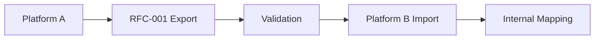

# RFC-001: Exercise Data Model Specification

**Status**: Draft
**Version**: 0.1.0
**Date**: 2025-09-02
**Authors**: VITNESS Team
**Category**: Standards Track

## Abstract

This specification defines a standardized data model for exercise information to enable interoperability and data portability across fitness applications and platforms. This RFC focuses on **how** to structure exercise data rather than dictating specific taxonomies, allowing platforms to maintain their own naming conventions while ensuring compatibility.

## 1. Introduction

### 1.1. Background

The fitness industry suffers from severe data fragmentation where each platform maintains incompatible exercise definitions, muscle group mappings, and categorization systems. This creates user lock-in, developer inefficiency, and ecosystem fragmentation.

### 1.2. Goals

This specification aims to:
1. Define structural requirements for exercise data interchange
2. Enable seamless data migration between fitness applications  
3. Support platform-specific taxonomies through extension mechanisms
4. Establish versioning strategies for long-term ecosystem health
5. Provide reference JSON Schema implementation

### 1.3. Scope

**In Scope:**
- Core exercise data structure and required fields
- Extension mechanisms for platform-specific data
- JSON Schema definitions and validation rules
- Versioning and migration strategies
- Reference examples and implementation guidance

**Out of Scope:**
- Specific exercise taxonomies or naming conventions
- Workout programming (future RFC-006)
- User progress tracking (future RFC-007) 
- Authentication/authorization mechanisms

## 2. Terminology

- **Exercise**: A distinct movement or activity performed for fitness purposes
- **Canonical Data**: Standardized identifying information (name, slug, aliases)
- **Classification**: Structural categorization data (type, movement, mechanics, etc.)
- **Extension**: Platform-specific data that doesn't break interoperability
- **Schema Version**: Semantic version indicating data model compatibility

## 3. Core Structural Requirements

### 3.1. Required Fields

:::danger MUST
All compliant exercise data **MUST** include these fields:
:::

```json
{
  "schemaVersion": "1.0.0",
  "exerciseId": "550e8400-e29b-41d4-a716-446655440000",
  "canonical": {
    "name": "Back Squat",
    "slug": "back-squat"
  },
  "classification": {
    "exerciseType": "strength",
    "movement": "squat",
    "mechanics": "compound",
    "force": "push",
    "level": "intermediate"
  },
  "targets": {
    "primary": [
      { "id": "mus.quadriceps", "name": "Quadriceps", "categoryId": "cat.legs" }
    ]
  },
  "metrics": {
    "primary": { "type": "reps", "unit": "count" }
  },
  "metadata": {
    "createdAt": "2025-09-02T15:00:00Z",
    "updatedAt": "2025-09-02T15:00:00Z",
    "status": "active"
  }
}
```

### 3.2. Optional Standard Fields

Commonly supported optional fields that enhance interoperability:

```json
{
  "equipment": {
    "required": [
      { "id": "eq.barbell", "name": "Barbell" },
      { "id": "eq.rack", "name": "Power Rack" }
    ],
    "optional": [
      { "id": "eq.belt", "name": "Lifting Belt" }
    ]
  },
  "constraints": {
    "contraindications": ["Acute knee injury without professional clearance"],
    "prerequisites": ["Bodyweight squat competency"],
    "progressions": ["High-bar back squat", "Paused back squat"],
    "regressions": ["Goblet squat", "Box squat"]
  },
  "relations": [
    { "type": "alternate", "targetId": "urn:slug:front-squat" },
    { "type": "regression", "targetId": "urn:slug:goblet-squat" }
  ],
  "media": [
    {
      "type": "video",
      "uri": "https://cdn.example.com/exercises/back-squat.mp4",
      "caption": "Side view, full-depth demo"
    }
  ]
}
```

### 3.3. Extension Mechanisms

Two extension points for platform-specific data:

#### 3.3.1. Attributes (Structured Extensions)
For common extensions that may become standardized:
```json
{
  "attributes": {
    "x:vitness.barPathHint": "midfoot → midfoot",
    "x:vitness.stanceWidth": "shoulder-width"
  }
}
```

#### 3.3.2. Extensions (Platform-Specific)  
For complex platform-unique data structures:
```json
{
  "extensions": {
    "x:vitness.tempo": { "eccentric": 3, "isometric": 1, "concentric": 1 },
    "x:vitness.rangeOfMotion": { "standard": "hip-crease below knee" }
  }
}
```

## 4. Reference Types and Structures

### 4.1. Canonical Information
```json
{
  "canonical": {
    "name": "Back Squat",
    "slug": "back-squat",
    "aliases": ["Barbell Back Squat", "BB Back Squat"],
    "localized": [
      { "lang": "sr", "name": "Сквот са шипком" },
      { "lang": "es", "name": "Sentadilla trasera", "aliases": ["Sentadilla con barra atrás"] }
    ]
  }
}
```

### 4.2. Classification Structure
```json
{
  "classification": {
    "exerciseType": "strength",
    "movement": "squat",
    "mechanics": "compound",
    "force": "push",
    "level": "intermediate",
    "unilateral": false,
    "kineticChain": "closed",
    "tags": ["bilateral","hipDominant"]
  }
}
```

### 4.3. Target Muscles
```json
{
  "targets": {
    "primary": [
      { "id": "mus.quadriceps", "name": "Quadriceps", "categoryId": "cat.legs" }
    ],
    "secondary": [
      { "id": "mus.hamstrings", "name": "Hamstrings", "categoryId": "cat.legs" },
      { "id": "mus.erectorSpinae", "name": "Erector Spinae", "categoryId": "cat.back" }
    ]
  }
}
```

### 4.4. Equipment References
```json
{
  "equipment": {
    "required": [
      { "id": "eq.barbell", "name": "Barbell" },
      { "id": "eq.rack", "name": "Power Rack" }
    ],
    "optional": [
      { "id": "eq.belt", "name": "Lifting Belt" }
    ]
  }
}
```

### 4.5. Metrics and Measurements
```json
{
  "metrics": {
    "primary": { "type": "reps", "unit": "count" },
    "secondary": [
      { "type": "weight", "unit": "lb" },
      { "type": "tempo", "unit": "count" },
      { "type": "rpe", "unit": "count" }
    ]
  }
}
```

## 5. Versioning and Compatibility

### 5.1. Schema Versioning

Following semantic versioning:
- **Major**: Breaking changes to required fields
- **Minor**: New optional fields or enum values  
- **Patch**: Documentation, validation updates

### 5.2. Compatibility Rules

- All data valid in version X.Y.Z must remain valid in X.Y+1.0
- New required fields must provide sensible defaults
- Deprecated fields remain functional for entire major version
- Migration paths must be documented for major version changes

### 5.3. Schema Evolution Example

Version 1.0.0 → 1.1.0 (Adding optional field):
```json
{
  "schemaVersion": "1.1.0",
  "exerciseId": "550e8400-e29b-41d4-a716-446655440000",
  "canonical": { "name": "Back Squat", "slug": "back-squat" },
  "classification": {
    "exerciseType": "strength",
    "movement": "squat", 
    "mechanics": "compound",
    "force": "push",
    "level": "intermediate"
  },
  "newOptionalField": {
    "feature": "value"
  }
}
```

## 6. Implementation Guidance

### 6.1. Platform Integration

Platforms implementing this standard should:

1. **Maintain Internal Models**: Keep existing taxonomies and domain models
2. **Export Compliance**: Provide data in RFC-001 format for portability
3. **Import Translation**: Map incoming RFC-001 data to internal structures
4. **Extension Usage**: Use `extensions` namespace for platform-specific data

### 6.2. Data Migration Workflow



1. Source platform exports exercises in RFC-001 format
2. Data validation against JSON Schema
3. Target platform imports and maps to internal model
4. Custom extensions handled based on platform capabilities

### 6.3. Discovery Mechanism

**TODO**: Evaluate need for well-known discovery endpoint:
```
GET /.well-known/fitness-data-spec
```

Potential response structure:
```json
{
  "spec_version": "1.0.0",
  "provider": "Platform Name", 
  "supported_extensions": ["namespace:field1", "namespace:field2"],
  "export_endpoint": "/api/exercises/export/rfc001"
}
```

## 7. Security and Privacy Considerations

- This specification defines data format only
- Implementations must validate against JSON Schema
- User-generated content in extensions should be sanitized
- Follow standard security practices for data transmission

## 8. JSON Schema Reference

Complete JSON Schema available at:
- **Exercise**: `/specification/schemas/exercises/v1.0.0/exercise.schema.json`
- **Equipment**: `/specification/schemas/equipment/v1.0.0/equipment.schema.json`  
- **Muscle**: `/specification/schemas/muscle/v1.0.0/muscle.schema.json`

## 8.1. Validation

Validate with Ajv (Draft 2020-12):

```
npx ajv -s specification/schemas/exercises/v1.0.0/exercise.schema.json \
  -d specification/schemas/exercises/v1.0.0/exercise.example.json

# Additional examples (optional):
npx ajv -s specification/schemas/exercises/v1.0.0/exercise.schema.json \
  -d specification/schemas/exercises/v1.0.0/exercise.example.cardio.json
npx ajv -s specification/schemas/exercises/v1.0.0/exercise.schema.json \
  -d specification/schemas/exercises/v1.0.0/exercise.example.mobility.json
npx ajv -s specification/schemas/exercises/v1.0.0/exercise.schema.json \
  -d specification/schemas/exercises/v1.0.0/exercise.example.machine.json
npx ajv -s specification/schemas/exercises/v1.0.0/exercise.schema.json \
  -d specification/schemas/exercises/v1.0.0/exercise.example.unilateral.json
```

## 9. Example Implementation

### 9.1. Complete Back Squat Export

Based on reference implementation (`/specification/schemas/exercises/v1.0.0/exercise.example.json`):

```json
{
  "schemaVersion": "1.0.0",
  "exerciseId": "550e8400-e29b-41d4-a716-446655440000",
  "canonical": {
    "name": "Back Squat",
    "slug": "back-squat",
    "aliases": ["Barbell Back Squat", "BB Back Squat"],
    "localized": [
      { "lang": "sr", "name": "Сквот са шипком" },
      { "lang": "es", "name": "Sentadilla trasera", "aliases": ["Sentadilla con barra atrás"] }
    ]
  },
  "classification": {
    "exerciseType": "strength",
    "movement": "squat",
    "mechanics": "compound",
    "force": "push",
    "level": "intermediate",
    "unilateral": false,
    "kineticChain": "closed",
    "tags": ["bilateral","hipDominant"]
  },
  "targets": {
    "primary": [
      { "id": "mus.quadriceps", "name": "Quadriceps", "categoryId": "cat.legs" }
    ],
    "secondary": [
      { "id": "mus.hamstrings", "name": "Hamstrings", "categoryId": "cat.legs" },
      { "id": "mus.erectorSpinae", "name": "Erector Spinae", "categoryId": "cat.back" }
    ]
  },
  "equipment": {
    "required": [
      { "id": "eq.barbell", "name": "Barbell" },
      { "id": "eq.rack", "name": "Power Rack" }
    ],
    "optional": [
      { "id": "eq.belt", "name": "Lifting Belt" }
    ]
  },
  "constraints": {
    "contraindications": ["Acute knee injury without professional clearance"],
    "prerequisites": ["Bodyweight squat competency"],
    "progressions": ["High-bar back squat", "Paused back squat"],
    "regressions": ["Goblet squat", "Box squat"]
  },
  "relations": [
    { "type": "alternate", "targetId": "urn:slug:front-squat" },
    { "type": "regression", "targetId": "urn:slug:goblet-squat" }
  ],
  "metrics": {
    "primary": { "type": "reps", "unit": "count" },
    "secondary": [
      { "type": "weight", "unit": "lb" },
      { "type": "tempo", "unit": "count" },
      { "type": "rpe", "unit": "count" }
    ]
  },
  "media": [
    {
      "type": "video",
      "uri": "https://cdn.example.com/exercises/back-squat.mp4",
      "caption": "Side view, full-depth demo",
      "license": "CC BY 4.0",
      "attribution": "Vitness"
    }
  ],
  "attributes": {
    "x:vitness.barPathHint": "midfoot → midfoot",
    "x:vitness.stanceWidth": "shoulder-width"
  },
  "extensions": {
    "x:vitness.tempo": { "eccentric": 3, "isometric": 1, "concentric": 1 },
    "x:vitness.rangeOfMotion": { "standard": "hip-crease below knee" }
  },
  "metadata": {
    "createdAt": "2025-09-02T15:00:00Z",
    "updatedAt": "2025-09-02T15:00:00Z",
    "status": "active",
    "source": "vitness.core",
    "version": "1.0.0"
  }
}
```

### 9.2. Platform Import Mapping (TypeScript Example)

Generic TypeScript example showing how a platform might import RFC-001 data:

```typescript
interface RFC001Exercise {
  schemaVersion: string;
  exerciseId: string;
  canonical: {
    name: string;
    slug: string;
    aliases?: string[];
    localized?: Array<{
      lang: string;
      name: string;
      aliases?: string[];
    }>;
  };
  classification: {
    exerciseType: string;
    movement: string;
    mechanics: string;
    force: string;
    level: string;
    unilateral?: boolean;
    kineticChain?: string;
    tags?: string[];
  };
  // ... other fields
  attributes?: Record<string, any>;
  extensions?: Record<string, any>;
}

// Platform-specific import mapping
function importExercise(rfc001Data: RFC001Exercise) {
  // Map required fields to internal structure
  const exercise = {
    id: rfc001Data.exerciseId,
    name: rfc001Data.canonical.name,
    slug: rfc001Data.canonical.slug,
    type: rfc001Data.classification.exerciseType,
    movement: rfc001Data.classification.movement,
    mechanics: rfc001Data.classification.mechanics,
    primaryMuscles: rfc001Data.targets?.primary?.map(m => ({
      id: m.id,
      name: m.name
    })) || []
  };

  // Handle platform-specific extensions
  if (rfc001Data.extensions?.['x:vitness.tempo']) {
    exercise.tempo = rfc001Data.extensions['x:vitness.tempo'];
  }

  // Handle common attributes
  if (rfc001Data.attributes?.['x:vitness.stanceWidth']) {
    exercise.stanceWidth = rfc001Data.attributes['x:vitness.stanceWidth'];
  }

  return exercise;
}

// Example usage with Back Squat data
const backSquatRFC001 = { /* RFC-001 data from example above */ };
const internalExercise = importExercise(backSquatRFC001);
```

## 10. References

## Conformance

**Conforming Producers:**

:::danger MUST
- **MUST** emit JSON that validates against the Exercise schema for the declared `schemaVersion`.
- **MUST** use UUIDv4 for all identifiers in production data (e.g., `exerciseId` and any referenced IDs). Example short IDs shown in this RFC are illustrative only.
- **MUST** populate all required fields and respect enumerations and structure.
:::

:::tip SHOULD
- **SHOULD** include RFC 3339 UTC timestamps in `metadata` and maintain accurate lifecycle fields.
:::

**Conforming Consumers:**

:::danger MUST
- **MUST** validate incoming exercise data against the appropriate schema version.
- **MUST** ignore unknown keys in `attributes` and `extensions`.
:::

:::tip SHOULD
- **SHOULD** tolerate additional optional fields introduced in newer minor versions.
- **SHOULD** reject data with missing required fields or invalid enumerations.
:::

**Compatibility:**

:::danger MUST
- Optional fields added in minor versions **MUST NOT** break consumers; consumers **SHOULD** ignore unknown optional fields.
- New required fields are a **MAJOR** change and require coordinated upgrades.
:::

---

Additional resources:
- Identifier and UUID policy: `/specification/README.md#identifiers-ids`
- i18n and slug conventions: `/specification/i18n-and-slugs.md`
- Metrics pairing guidance: `/specification/metrics-guide.md`
- Extension policy and registry guide: `/specification/extension-registry.md`
- Discovery endpoint: `/specification/discovery.md`

### 10.1. Normative References
- [JSON Schema Draft 2020-12](https://json-schema.org/draft/2020-12/schema)
- [RFC 4122: UUID](https://tools.ietf.org/html/rfc4122) 
- [RFC 3339: Date/Time](https://tools.ietf.org/html/rfc3339)
---

Copyright Notice  
Copyright (c) 2025 VITNESS.
This document is subject to the rights, licenses and restrictions contained in the VITNESS Open Standards License Agreement. See `/specification/VITNESS Open Standards License Agreement.md`.
