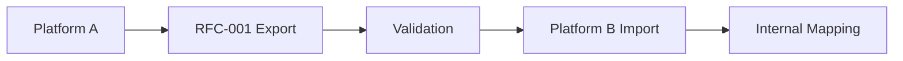

# RFC-001: Especificación del modelo de datos de ejercicio

**Estado**: Borrador
**Versión**: 0.1.0
**Fecha**: 2025-09-02
**Autores**: Equipo VITNESS
**Categoría**: Standards Track

## Resumen

Esta especificación define un modelo de datos estandarizado para la información de ejercicios, con el fin de habilitar la interoperabilidad y la portabilidad de datos entre aplicaciones y plataformas de fitness. Este RFC se centra en **cómo** estructurar los datos de ejercicios en lugar de dictar taxonomías específicas, lo que permite a las plataformas mantener sus propias convenciones de nomenclatura y asegurar a la vez la compatibilidad.

## 1. Introducción

### 1.1. Antecedentes

La industria del fitness sufre una fragmentación de datos severa, en la que cada plataforma mantiene definiciones de ejercicios, mapeos de grupos musculares y sistemas de categorización incompatibles. Esto genera cautividad de los usuarios, ineficiencia para los desarrolladores y fragmentación del ecosistema.

### 1.2. Objetivos

Esta especificación se propone:
1. Definir los requisitos estructurales para el intercambio de datos de ejercicios
2. Habilitar la migración fluida de datos entre aplicaciones de fitness
3. Admitir taxonomías específicas de cada plataforma mediante mecanismos de extensión
4. Establecer estrategias de versionado para la salud del ecosistema a largo plazo
5. Proporcionar una implementación de referencia en JSON Schema

### 1.3. Alcance

**Dentro del alcance:**
- Estructura básica de los datos de ejercicio y campos obligatorios
- Mecanismos de extensión para datos específicos de plataforma
- Definiciones de JSON Schema y reglas de validación
- Estrategias de versionado y migración
- Ejemplos de referencia y guía de implementación

**Fuera del alcance:**
- Taxonomías de ejercicios o convenciones de nomenclatura específicas
- Programación de sesiones de entrenamiento (futuro RFC-006)
- Seguimiento del progreso del usuario (futuro RFC-007)
- Mecanismos de autenticación/autorización

## 2. Terminología

- **Ejercicio**: Un movimiento o actividad diferenciada que se realiza con fines de fitness
- **Datos canónicos**: Información identificativa estandarizada (nombre, slug, alias)
- **Clasificación**: Datos de categorización estructural (tipo, movimiento, mecánica, etc.)
- **Extensión**: Datos específicos de plataforma que no rompen la interoperabilidad
- **Versión de esquema**: Versión semántica que indica la compatibilidad del modelo de datos

## 3. Requisitos estructurales fundamentales

### 3.1. Campos obligatorios

<!-- fds:count required:exercise=7 -->
7 campos son obligatorios: `schemaVersion`, `exerciseId`, `canonical` (el nombre y el slug por los que se conoce este ejercicio), `classification` (qué clase de movimiento es), `targets` (qué entrena), `metrics` (cómo se mide) y `metadata`.

Un ejercicio al que le falte cualquiera de ellos no es identificable, no es clasificable o no es medible, y cada una de esas carencias lo vuelve inutilizable para un consumidor, no meramente incompleto.

:::danger DEBE
Todos los datos de ejercicio conformes **DEBEN** incluir estos campos:
:::

```json
{
  "schemaVersion": "1.1.0",
  "exerciseId": "550e8400-e29b-41d4-a716-446655440000",
  "canonical": {
    "name": "Back Squat",
    "slug": "back-squat"
  },
  "classification": {
    "exerciseType": "strength",
    "movement": "squat",
    "mechanics": "compound",
    "force": "push",
    "level": "intermediate"
  },
  "targets": {
    "primary": [
      { "id": "mus.quadriceps", "name": "Quadriceps", "categoryId": "cat.legs" }
    ]
  },
  "metrics": {
    "primary": { "type": "reps", "unit": "count" }
  },
  "metadata": {
    "createdAt": "2025-09-02T15:00:00Z",
    "updatedAt": "2025-09-02T15:00:00Z",
    "status": "active"
  }
}
```

### 3.2. Campos estándar opcionales

Cuatro campos opcionales transportan la mayor parte de lo que una implementación realmente renderiza.

`equipment` se divide entre aquello sin lo cual el movimiento no puede realizarse y lo que simplemente ayuda. `media` transporta los recursos de demostración.

`constraints` registra lo que el ejercicio exige antes de intentarse: `contraindications` (condiciones bajo las cuales no debería realizarse), `prerequisites` (competencias que presupone), `progressions` y `regressions` (movimientos más difíciles y más fáciles sobre el mismo patrón) y `environment` (dónde puede hacerse). Se trata de prosa orientativa, no de controles verificables por máquina — FDS no modela ningún atleta contra el cual comprobar un prerrequisito.

`relations` enlaza este ejercicio con otros. Cada entrada transporta un `type` tomado de `relationTypes` — `alternate`, `variation`, `substitute`, `progression`, `regression`, `equipmentVariant`, `accessory`, `mobilityPrep`, `similarPattern`, `unilateralPair`, `contralateralPair` —, un `targetId`, un `confidence` opcional entre 0 y 1 y unas `notes` opcionales.

`confidence` existe porque las relaciones se derivan con frecuencia de forma automática. Un consumidor que filtra un catálogo grande necesita saber si un enlace fue afirmado por un editor o inferido por una pasada de similitud, y sin el campo no puede distinguir entre ambos casos.

Téngase en cuenta que `constraints.progressions` y `constraints.regressions` son descripciones de texto libre, mientras que una entrada de `relations` de tipo `progression` es un enlace a otro ejercicio. Ambos existen porque un autor a menudo sabe *que* un movimiento es más difícil antes de que el movimiento más difícil esté en el catálogo.

```json fds:fragment entity=exercise
{
  "equipment": {
    "required": [
      { "id": "eq.barbell", "name": "Barbell" },
      { "id": "eq.rack", "name": "Power Rack" }
    ],
    "optional": [
      { "id": "eq.belt", "name": "Lifting Belt" }
    ]
  },
  "constraints": {
    "contraindications": ["Acute knee injury without professional clearance"],
    "prerequisites": ["Bodyweight squat competency"],
    "progressions": ["High-bar back squat", "Paused back squat"],
    "regressions": ["Goblet squat", "Box squat"]
  },
  "relations": [
    { "type": "alternate", "targetId": "urn:slug:front-squat" },
    { "type": "regression", "targetId": "urn:slug:goblet-squat" }
  ],
  "media": [
    {
      "type": "video",
      "uri": "https://cdn.example.com/exercises/back-squat.mp4",
      "caption": "Side view, full-depth demo"
    }
  ]
}
```

### 3.3. Mecanismos de extensión

Dos puntos de extensión para datos específicos de plataforma:

#### 3.3.1. Atributos (extensiones estructuradas)
Para extensiones comunes que pueden llegar a estandarizarse:
```json fds:fragment entity=exercise
{
  "attributes": {
    "x:vitness.barPathHint": "midfoot → midfoot",
    "x:vitness.stanceWidth": "shoulder-width"
  }
}
```

#### 3.3.2. Extensiones (específicas de plataforma)
Para estructuras de datos complejas y exclusivas de una plataforma:
```json fds:fragment entity=exercise
{
  "extensions": {
    "x:vitness.tempo": { "eccentric": 3, "isometric": 1, "concentric": 1 },
    "x:vitness.rangeOfMotion": { "standard": "hip-crease below knee" }
  }
}
```

## 4. Tipos y estructuras de referencia

### 4.1. Información canónica

`canonical` transporta la identidad del ejercicio tal como la ve un lector: un `name` para mostrar, un `slug` estable, `aliases` opcionales y entradas `localized` que dan el nombre en otros idiomas. El slug es el identificador legible por humanos y es distinto de `exerciseId`; véase el §3 de la política de identificadores.

```json fds:fragment entity=exercise
{
  "canonical": {
    "name": "Back Squat",
    "slug": "back-squat",
    "aliases": ["Barbell Back Squat", "BB Back Squat"],
    "localized": [
      { "lang": "sr", "name": "Сквот са шипком" },
      { "lang": "es", "name": "Sentadilla trasera", "aliases": ["Sentadilla con barra atrás"] }
    ]
  }
}
```

### 4.2. Estructura de clasificación

`classification` responde qué clase de movimiento es este. Cinco de sus campos son obligatorios.

| Campo | Significado |
|---|---|
| `exerciseType` | La categoría amplia — una **cadena abierta** según D8, con valores recomendados en el registro de tipos de ejercicio. Un valor no reconocido es un ejercicio mal etiquetado, no uno inválido, así que los consumidores advierten en lugar de rechazar. |
| `movement` | El patrón de movimiento: `squat`, `hinge`, `lunge`, las direcciones de empuje y tracción, `carry`, los patrones del core, `rotation`, `locomotion`, `isolation`, `other`. |
| `mechanics` | `compound` o `isolation` — si interviene más de una articulación. |
| `force` | `push`, `pull`, `static` o `mixed`. |
| `level` | `beginner`, `intermediate` o `advanced`. |
| `unilateral` | Si trabaja un lado a la vez. Opcional, con false como valor predeterminado. Es lo que hace significativo el `side` de una serie. |
| `kineticChain` | `open`, `closed` o `mixed`. Opcional. |
| `tags` | Etiquetas de forma libre para filtrar. No conlleva ninguna consecuencia estructural. |
| `taxonomyRefs` | Referencias hacia una taxonomía externa — cada una un objeto de `registry`, `id` y un `label` opcional legible por humanos. Así es como una implementación mantiene su propia clasificación junto a la de FDS sin que ninguna sobrescriba a la otra. |

```json fds:fragment entity=exercise
{
  "classification": {
    "exerciseType": "strength",
    "movement": "squat",
    "mechanics": "compound",
    "force": "push",
    "level": "intermediate",
    "unilateral": false,
    "kineticChain": "closed",
    "tags": ["bilateral","hipDominant"]
  }
}
```

### 4.3. Músculos objetivo

`targets.primary` enumera los músculos por los que se elige el ejercicio y es obligatorio; `targets.secondary` enumera los que participan de manera significativa pero no son el propósito del movimiento. Cada entrada es una referencia de músculo — un `id`, un `name` para mostrar y el `categoryId` del grupo al que pertenece — desnormalizada para que un consumidor pueda renderizar el ejercicio sin resolver el catálogo de músculos.

La división importa para cualquier cosa que calcule el volumen de entrenamiento por músculo: contar la participación secundaria como primaria infla el volumen de una manera que se acumula a lo largo de un programa.

```json fds:fragment entity=exercise
{
  "targets": {
    "primary": [
      { "id": "mus.quadriceps", "name": "Quadriceps", "categoryId": "cat.legs" }
    ],
    "secondary": [
      { "id": "mus.hamstrings", "name": "Hamstrings", "categoryId": "cat.legs" },
      { "id": "mus.erectorSpinae", "name": "Erector Spinae", "categoryId": "cat.back" }
    ]
  }
}
```

### 4.4. Referencias de equipamiento

`equipment.required` es aquello sin lo cual el movimiento no puede realizarse; `equipment.optional` es lo que cambia la experiencia pero no el ejercicio. Cada entrada desnormaliza un `id` y un `name` por la misma razón que lo hacen los músculos objetivo.

```json fds:fragment entity=exercise
{
  "equipment": {
    "required": [
      { "id": "eq.barbell", "name": "Barbell" },
      { "id": "eq.rack", "name": "Power Rack" }
    ],
    "optional": [
      { "id": "eq.belt", "name": "Lifting Belt" }
    ]
  }
}
```

### 4.5. Métricas y mediciones

`metrics.primary` es la medición en la que fundamentalmente se cuenta el ejercicio, y es obligatorio. `metrics.secondary` enumera mediciones adicionales que aplican.

Cada una es un par `{ type, unit }` y **no transporta valor** — esto es una declaración de forma, no una medición. Adjuntar valores a estas formas es lo que hace una prescripción de sesión de entrenamiento (RFC-007), y una prescripción DEBERÍA usar solo tipos de métrica que el ejercicio declare aquí.

```json fds:fragment entity=exercise
{
  "metrics": {
    "primary": { "type": "reps", "unit": "count" },
    "secondary": [
      { "type": "weight", "unit": "lb" },
      { "type": "tempo", "unit": "count" },
      { "type": "rpe", "unit": "count" }
    ]
  }
}
```


### 4.6. Características de carga

El objeto opcional `loading` describe **cómo un movimiento acepta carga externa**. Responde lo que de otro modo un consumidor tiene que inferir del nombre del ejercicio: si el movimiento puede cargarse en absoluto, si la carga añadida lo hace más difícil o más fácil, y si los dos lados pueden cargarse de forma independiente.

```json fds:fragment entity=exercise
{
  "loading": {
    "externalLoad": "required",
    "assisted": false,
    "asymmetric": false
  }
}
```

| Campo | Tipo | Predeterminado | Significado |
|---|---|---|---|
| `externalLoad` | `"none"` \| `"optional"` \| `"required"` | — | Si el movimiento puede transportar carga externa en absoluto |
| `assisted` | boolean | `false` | La carga puede ser negativa — la asistencia reduce el peso corporal efectivo |
| `asymmetric` | boolean | `false` | Los lados izquierdo y derecho pueden cargarse de forma independiente |

Valores de `externalLoad`:

- **`none`** — el movimiento no puede cargarse externamente (un estiramiento de isquiotibiales de pie). Una métrica `weight` en un ejercicio así es un error del productor.
- **`optional`** — el movimiento funciona con o sin carga (una flexión de brazos, con o sin un disco sobre la espalda).
- **`required`** — el movimiento carece de sentido sin carga (un press de banca con barra).

`assisted: true` invierte el signo de la carga. En una máquina de dominadas asistidas, *más* peso seleccionado hace el movimiento *más fácil*. Los consumidores que grafican el progreso NO DEBEN tratar un aumento de carga en un movimiento asistido como un aumento de esfuerzo.

`asymmetric: true` significa que un productor PUEDE informar la carga por lado; no lo exige.

**Los incrementos deliberadamente no forman parte de este objeto.** El paso de carga más pequeño utilizable es una propiedad del implemento, no del movimiento — un par de discos de 2.5 kg, un salto de 5 lb entre mancuernas, un pasador en una torre de placas. Vive en `equipment.loading.increment` (RFC-002 §4.4). El mismo movimiento realizado con mancuernas y con barra tiene dos pasos mínimos distintos, algo que un solo campo en el ejercicio no podría expresar.

Los consumidores NO DEBEN rechazar un ejercicio que omite `loading`. La ausencia significa no declarado, no `none`.

## 5. Versionado y compatibilidad

### 5.1. Versionado de esquemas

Siguiendo el versionado semántico:
- **Mayor**: Cambios incompatibles en los campos obligatorios
- **Menor**: Nuevos campos opcionales o valores de enumeración
- **Parche**: Actualizaciones de documentación y validación

### 5.2. Reglas de compatibilidad

- Todos los datos válidos en la versión X.Y.Z deben seguir siendo válidos en X.Y+1.0
- Los nuevos campos obligatorios deben proporcionar valores predeterminados razonables
- Los campos obsoletos permanecen funcionales durante toda la versión mayor
- Las rutas de migración deben documentarse para los cambios de versión mayor

### 5.3. Ejemplo de evolución del esquema

Versión 1.0.0 → 1.1.0 (adición de un campo opcional):
```json fds:ignore a hypothetical next version illustrating how an optional field arrives; no published exercise schema has newOptionalField
{
  "schemaVersion": "1.1.0",
  "exerciseId": "550e8400-e29b-41d4-a716-446655440000",
  "canonical": { "name": "Back Squat", "slug": "back-squat" },
  "classification": {
    "exerciseType": "strength",
    "movement": "squat", 
    "mechanics": "compound",
    "force": "push",
    "level": "intermediate"
  },
  "newOptionalField": {
    "feature": "value"
  }
}
```

## 6. Guía de implementación

### 6.1. Integración de plataformas

Las plataformas que implementan este estándar deberían:

1. **Mantener modelos internos**: Conservar las taxonomías y los modelos de dominio existentes
2. **Cumplimiento en la exportación**: Proporcionar los datos en formato RFC-001 para la portabilidad
3. **Traducción en la importación**: Mapear los datos RFC-001 entrantes a las estructuras internas
4. **Uso de extensiones**: Usar el espacio de nombres `extensions` para datos específicos de plataforma

### 6.2. Flujo de trabajo de migración de datos



1. La plataforma de origen exporta los ejercicios en formato RFC-001
2. Validación de los datos contra el JSON Schema
3. La plataforma de destino importa y mapea al modelo interno
4. Las extensiones personalizadas se gestionan según las capacidades de la plataforma

### 6.3. Mecanismo de descubrimiento

**TODO**: Evaluar la necesidad de un endpoint de descubrimiento well-known:
```
GET /.well-known/fitness-data-spec
```

Estructura de respuesta potencial:
```json fds:ignore a discovery document, defined by specification/discovery.md rather than by a published schema
{
  "spec_version": "1.0.0",
  "provider": "Platform Name", 
  "supported_extensions": ["namespace:field1", "namespace:field2"],
  "export_endpoint": "/api/exercises/export/rfc001"
}
```

## 7. Consideraciones de seguridad y privacidad

- Esta especificación define únicamente el formato de los datos
- Las implementaciones deben validar contra el JSON Schema
- El contenido generado por usuarios en las extensiones debería sanitizarse
- Seguir las prácticas de seguridad estándar para la transmisión de datos

## 8. Referencia de JSON Schema

El JSON Schema completo está disponible en:
- **Ejercicio**: `/specification/schemas/exercises/v1.1.0/exercise.schema.json`
- **Equipamiento**: `/specification/schemas/equipment/v1.1.0/equipment.schema.json`
- **Músculo**: `/specification/schemas/muscle/v1.0.0/muscle.schema.json`

## 8.1. Validación

Validar con Ajv (Draft 2020-12):

```
npx --package=ajv-cli --package=ajv-formats ajv validate --spec=draft2020 -c ajv-formats \
  -s specification/schemas/exercises/v1.1.0/exercise.schema.json \
  -d specification/schemas/exercises/v1.1.0/exercise.example.json

# Additional examples (optional):
npx --package=ajv-cli --package=ajv-formats ajv validate --spec=draft2020 -c ajv-formats \
  -s specification/schemas/exercises/v1.1.0/exercise.schema.json \
  -d specification/schemas/exercises/v1.1.0/exercise.example.cardio.json
npx --package=ajv-cli --package=ajv-formats ajv validate --spec=draft2020 -c ajv-formats \
  -s specification/schemas/exercises/v1.1.0/exercise.schema.json \
  -d specification/schemas/exercises/v1.1.0/exercise.example.mobility.json
npx --package=ajv-cli --package=ajv-formats ajv validate --spec=draft2020 -c ajv-formats \
  -s specification/schemas/exercises/v1.1.0/exercise.schema.json \
  -d specification/schemas/exercises/v1.1.0/exercise.example.machine.json
npx --package=ajv-cli --package=ajv-formats ajv validate --spec=draft2020 -c ajv-formats \
  -s specification/schemas/exercises/v1.1.0/exercise.schema.json \
  -d specification/schemas/exercises/v1.1.0/exercise.example.unilateral.json
```

## 9. Ejemplo de implementación

### 9.1. Exportación completa de la sentadilla trasera

Basado en la implementación de referencia (`/specification/schemas/exercises/v1.1.0/exercise.example.json`):

```json
{
  "schemaVersion": "1.1.0",
  "exerciseId": "550e8400-e29b-41d4-a716-446655440000",
  "canonical": {
    "name": "Back Squat",
    "slug": "back-squat",
    "aliases": ["Barbell Back Squat", "BB Back Squat"],
    "localized": [
      { "lang": "sr", "name": "Сквот са шипком" },
      { "lang": "es", "name": "Sentadilla trasera", "aliases": ["Sentadilla con barra atrás"] }
    ]
  },
  "classification": {
    "exerciseType": "strength",
    "movement": "squat",
    "mechanics": "compound",
    "force": "push",
    "level": "intermediate",
    "unilateral": false,
    "kineticChain": "closed",
    "tags": ["bilateral","hipDominant"]
  },
  "targets": {
    "primary": [
      { "id": "mus.quadriceps", "name": "Quadriceps", "categoryId": "cat.legs" }
    ],
    "secondary": [
      { "id": "mus.hamstrings", "name": "Hamstrings", "categoryId": "cat.legs" },
      { "id": "mus.erectorSpinae", "name": "Erector Spinae", "categoryId": "cat.back" }
    ]
  },
  "equipment": {
    "required": [
      { "id": "eq.barbell", "name": "Barbell" },
      { "id": "eq.rack", "name": "Power Rack" }
    ],
    "optional": [
      { "id": "eq.belt", "name": "Lifting Belt" }
    ]
  },
  "constraints": {
    "contraindications": ["Acute knee injury without professional clearance"],
    "prerequisites": ["Bodyweight squat competency"],
    "progressions": ["High-bar back squat", "Paused back squat"],
    "regressions": ["Goblet squat", "Box squat"]
  },
  "relations": [
    { "type": "alternate", "targetId": "urn:slug:front-squat" },
    { "type": "regression", "targetId": "urn:slug:goblet-squat" }
  ],
  "metrics": {
    "primary": { "type": "reps", "unit": "count" },
    "secondary": [
      { "type": "weight", "unit": "lb" },
      { "type": "tempo", "unit": "count" },
      { "type": "rpe", "unit": "count" }
    ]
  },
  "media": [
    {
      "type": "video",
      "uri": "https://cdn.example.com/exercises/back-squat.mp4",
      "caption": "Side view, full-depth demo",
      "license": "CC BY 4.0",
      "attribution": "Vitness"
    }
  ],
  "attributes": {
    "x:vitness.barPathHint": "midfoot → midfoot",
    "x:vitness.stanceWidth": "shoulder-width"
  },
  "extensions": {
    "x:vitness.tempo": { "eccentric": 3, "isometric": 1, "concentric": 1 },
    "x:vitness.rangeOfMotion": { "standard": "hip-crease below knee" }
  },
  "metadata": {
    "createdAt": "2025-09-02T15:00:00Z",
    "updatedAt": "2025-09-02T15:00:00Z",
    "status": "active",
    "source": "vitness.core",
    "version": "1.0.0"
  }
}
```

### 9.2. Mapeo de importación de plataforma (ejemplo en TypeScript)

Ejemplo genérico en TypeScript que muestra cómo una plataforma podría importar datos RFC-001:

```typescript
interface RFC001Exercise {
  schemaVersion: string;
  exerciseId: string;
  canonical: {
    name: string;
    slug: string;
    aliases?: string[];
    localized?: Array<{
      lang: string;
      name: string;
      aliases?: string[];
    }>;
  };
  classification: {
    exerciseType: string;
    movement: string;
    mechanics: string;
    force: string;
    level: string;
    unilateral?: boolean;
    kineticChain?: string;
    tags?: string[];
  };
  // ... other fields
  attributes?: Record<string, any>;
  extensions?: Record<string, any>;
}

// Platform-specific import mapping
function importExercise(rfc001Data: RFC001Exercise) {
  // Map required fields to internal structure
  const exercise = {
    id: rfc001Data.exerciseId,
    name: rfc001Data.canonical.name,
    slug: rfc001Data.canonical.slug,
    type: rfc001Data.classification.exerciseType,
    movement: rfc001Data.classification.movement,
    mechanics: rfc001Data.classification.mechanics,
    primaryMuscles: rfc001Data.targets?.primary?.map(m => ({
      id: m.id,
      name: m.name
    })) || []
  };

  // Handle platform-specific extensions
  if (rfc001Data.extensions?.['x:vitness.tempo']) {
    exercise.tempo = rfc001Data.extensions['x:vitness.tempo'];
  }

  // Handle common attributes
  if (rfc001Data.attributes?.['x:vitness.stanceWidth']) {
    exercise.stanceWidth = rfc001Data.attributes['x:vitness.stanceWidth'];
  }

  return exercise;
}

// Example usage with Back Squat data
const backSquatRFC001 = { /* RFC-001 data from example above */ };
const internalExercise = importExercise(backSquatRFC001);
```

## 10. Referencias

## Conformidad

**Productores conformes:**

:::danger DEBE
- **DEBEN** emitir JSON que valide contra el esquema de ejercicio para la `schemaVersion` declarada.
- **DEBEN** usar UUIDv4 para todos los identificadores en datos de producción (p. ej., `exerciseId` y cualquier ID referenciado). Los ID cortos de ejemplo mostrados en este RFC son solo ilustrativos.
- **DEBEN** poblar todos los campos obligatorios y respetar las enumeraciones y la estructura.
:::

:::tip DEBERÍA
- **DEBERÍAN** incluir marcas de tiempo UTC RFC 3339 en `metadata` y mantener campos de ciclo de vida precisos.
:::

**Consumidores conformes:**

:::danger DEBE
- **DEBEN** validar los datos de ejercicio entrantes contra la versión de esquema apropiada.
- **DEBEN** ignorar las claves desconocidas en `attributes` y `extensions`.
:::

:::tip DEBERÍA
- **DEBERÍAN** tolerar campos opcionales adicionales introducidos en versiones menores más recientes.
- **DEBERÍAN** rechazar datos con campos obligatorios ausentes o enumeraciones inválidas.
:::

**Compatibilidad:**

:::danger DEBE
- Los campos opcionales añadidos en versiones menores **NO DEBEN** romper a los consumidores; los consumidores **DEBERÍAN** ignorar los campos opcionales desconocidos.
- Los nuevos campos obligatorios son un cambio **MAYOR** y requieren actualizaciones coordinadas.
:::

---

Recursos adicionales:
- Política de identificadores y UUID: `/specification/README.md#identifiers-ids`
- Convenciones de i18n y slugs: `/specification/i18n-and-slugs.md`
- Guía de emparejamiento de métricas: `/specification/metrics-guide.md`
- Política de extensiones y guía del registro: `/specification/extension-registry.md`
- Endpoint de descubrimiento: `/specification/discovery.md`

### 10.1. Referencias normativas
- [JSON Schema Draft 2020-12](https://json-schema.org/draft/2020-12/schema)
- [RFC 4122: UUID](https://tools.ietf.org/html/rfc4122)
- [RFC 3339: Fecha/hora](https://tools.ietf.org/html/rfc3339)
---

Aviso de copyright  
Copyright (c) 2025 VITNESS.
Este documento está sujeto a los derechos, licencias y restricciones contenidos en el VITNESS Open Standards License Agreement. Véase `/specification/VITNESS Open Standards License Agreement.md`.
