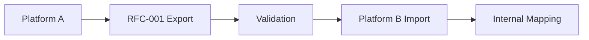

# RFC-001: Specifikacija modela podataka o vežbi

**Status**: Nacrt
**Verzija**: 0.1.0
**Datum**: 2025-09-02
**Autori**: VITNESS tim
**Kategorija**: Standards Track

## Sažetak

Ova specifikacija definiše standardizovani model podataka za informacije o vežbama radi omogućavanja interoperabilnosti i prenosivosti podataka među fitnes aplikacijama i platformama. Ovaj RFC se usredsređuje na **kako** strukturirati podatke o vežbama, umesto da diktira konkretne taksonomije, čime platformama dozvoljava da zadrže sopstvene konvencije imenovanja uz obezbeđenu kompatibilnost.

## 1. Uvod

### 1.1. Pozadina

Fitnes industrija pati od ozbiljne fragmentacije podataka, gde svaka platforma održava nekompatibilne definicije vežbi, mapiranja mišićnih grupa i sisteme kategorizacije. To stvara vezivanje korisnika, neefikasnost za programere i fragmentaciju ekosistema.

### 1.2. Ciljevi

Ova specifikacija ima za cilj da:
1. Definiše strukturne zahteve za razmenu podataka o vežbama
2. Omogući neometanu migraciju podataka između fitnes aplikacija  
3. Podrži taksonomije specifične za platformu kroz mehanizme ekstenzija
4. Uspostavi strategije verzionisanja za dugoročno zdravlje ekosistema
5. Obezbedi referentnu implementaciju JSON šeme

### 1.3. Obuhvat

**U obuhvatu:**
- Osnovna struktura podataka o vežbi i obavezna polja
- Mehanizmi ekstenzija za podatke specifične za platformu
- Definicije JSON šema i pravila validacije
- Strategije verzionisanja i migracije
- Referentni primeri i smernice za implementaciju

**Van obuhvata:**
- Konkretne taksonomije vežbi ili konvencije imenovanja
- Programiranje treninga (budući RFC-006)
- Praćenje napretka korisnika (budući RFC-007) 
- Mehanizmi autentifikacije/autorizacije

## 2. Terminologija

- **Vežba**: Zaseban pokret ili aktivnost koja se izvodi u fitnes svrhe
- **Kanonski podaci**: Standardizovane identifikujuće informacije (naziv, slug, alijasi)
- **Klasifikacija**: Strukturni podaci o kategorizaciji (tip, pokret, mehanika itd.)
- **Ekstenzija**: Podaci specifični za platformu koji ne narušavaju interoperabilnost
- **Verzija šeme**: Semantička verzija koja označava kompatibilnost modela podataka

## 3. Osnovni strukturni zahtevi

### 3.1. Obavezna polja

Šest polja je obavezno: `schemaVersion`, `exerciseId`, `canonical` (naziv i slug pod kojima je ova vežba poznata), `classification` (koja je to vrsta pokreta), `targets` (šta trenira), `metrics` (kako se meri) i `metadata`.

Vežba kojoj nedostaje bilo koje od njih ne može se identifikovati, klasifikovati ili meriti, a svaki od tih nedostataka je čini neupotrebljivom za konzumenta, a ne tek nepotpunom.

:::danger MORA
Svi usaglašeni podaci o vežbama **MORAJU** da sadrže ova polja:
:::

```json
{
  "schemaVersion": "1.1.0",
  "exerciseId": "550e8400-e29b-41d4-a716-446655440000",
  "canonical": {
    "name": "Back Squat",
    "slug": "back-squat"
  },
  "classification": {
    "exerciseType": "strength",
    "movement": "squat",
    "mechanics": "compound",
    "force": "push",
    "level": "intermediate"
  },
  "targets": {
    "primary": [
      { "id": "mus.quadriceps", "name": "Quadriceps", "categoryId": "cat.legs" }
    ]
  },
  "metrics": {
    "primary": { "type": "reps", "unit": "count" }
  },
  "metadata": {
    "createdAt": "2025-09-02T15:00:00Z",
    "updatedAt": "2025-09-02T15:00:00Z",
    "status": "active"
  }
}
```

### 3.2. Opciona standardna polja

Četiri opciona polja nose najveći deo onoga što implementacija zaista prikazuje.

`equipment` se deli na ono bez čega pokret ne može da se izvede i ono što samo pomaže. `media` nosi resurse za demonstraciju.

`constraints` beleži šta vežba zahteva pre nego što se pokuša: `contraindications` (stanja pod kojima ne bi trebalo da se izvodi), `prerequisites` (kompetencije koje pretpostavlja), `progressions` i `regressions` (teže i lakše pokrete na istom obrascu) i `environment` (gde može da se izvede). Ovo je savetodavna proza, a ne mašinski sprovodive kapije — FDS ne modeluje nijednog sportistu prema kome bi se preduslov proverio.

`relations` povezuje ovu vežbu sa drugima. Svaki unos nosi `type` iz `relationTypes` — `alternate`, `variation`, `substitute`, `progression`, `regression`, `equipmentVariant`, `accessory`, `mobilityPrep`, `similarPattern`, `unilateralPair`, `contralateralPair` — zatim `targetId`, opcioni `confidence` između 0 i 1 i opcione `notes`.

`confidence` postoji zato što su relacije često mašinski izvedene. Konzument koji filtrira veliki katalog mora da zna da li je vezu uneo urednik kao tvrdnju ili ju je izveo prolaz sličnosti, a bez tog polja ne može da ih razlikuje.

Imajte na umu da su `constraints.progressions` i `constraints.regressions` opisi u slobodnom tekstu, dok je unos u `relations` tipa `progression` veza ka drugoj vežbi. Oba postoje zato što autor često zna *da* je neki pokret teži pre nego što se taj teži pokret nađe u katalogu.

```json fds:fragment entity=exercise
{
  "equipment": {
    "required": [
      { "id": "eq.barbell", "name": "Barbell" },
      { "id": "eq.rack", "name": "Power Rack" }
    ],
    "optional": [
      { "id": "eq.belt", "name": "Lifting Belt" }
    ]
  },
  "constraints": {
    "contraindications": ["Acute knee injury without professional clearance"],
    "prerequisites": ["Bodyweight squat competency"],
    "progressions": ["High-bar back squat", "Paused back squat"],
    "regressions": ["Goblet squat", "Box squat"]
  },
  "relations": [
    { "type": "alternate", "targetId": "urn:slug:front-squat" },
    { "type": "regression", "targetId": "urn:slug:goblet-squat" }
  ],
  "media": [
    {
      "type": "video",
      "uri": "https://cdn.example.com/exercises/back-squat.mp4",
      "caption": "Side view, full-depth demo"
    }
  ]
}
```

### 3.3. Mehanizmi ekstenzija

Dve tačke proširenja za podatke specifične za platformu:

#### 3.3.1. Atributi (strukturirane ekstenzije)
Za uobičajene ekstenzije koje mogu postati standardizovane:
```json fds:fragment entity=exercise
{
  "attributes": {
    "x:vitness.barPathHint": "midfoot → midfoot",
    "x:vitness.stanceWidth": "shoulder-width"
  }
}
```

#### 3.3.2. Ekstenzije (specifične za platformu)  
Za složene strukture podataka jedinstvene za platformu:
```json fds:fragment entity=exercise
{
  "extensions": {
    "x:vitness.tempo": { "eccentric": 3, "isometric": 1, "concentric": 1 },
    "x:vitness.rangeOfMotion": { "standard": "hip-crease below knee" }
  }
}
```

## 4. Referentni tipovi i strukture

### 4.1. Kanonske informacije

`canonical` nosi identitet vežbe onako kako ga čitalac vidi: prikazni `name`, stabilan `slug`, opcione `aliases` i `localized` unose koji daju naziv na drugim jezicima. Slug je identifikator čitljiv ljudima i različit je od `exerciseId`; pogledajte §3 politike identifikatora.

```json fds:fragment entity=exercise
{
  "canonical": {
    "name": "Back Squat",
    "slug": "back-squat",
    "aliases": ["Barbell Back Squat", "BB Back Squat"],
    "localized": [
      { "lang": "sr", "name": "Сквот са шипком" },
      { "lang": "es", "name": "Sentadilla trasera", "aliases": ["Sentadilla con barra atrás"] }
    ]
  }
}
```

### 4.2. Struktura klasifikacije

`classification` odgovara na pitanje koja je ovo vrsta pokreta. Pet njegovih polja je obavezno.

| Polje | Značenje |
|---|---|
| `exerciseType` | Široka kategorija — **otvoreni string** po D8, sa preporučenim vrednostima u registru tipova vežbi. Neprepoznata vrednost je pogrešno označena vežba, a ne nevažeća, pa konzumenti upozoravaju umesto da odbacuju. |
| `movement` | Obrazac pokreta: `squat`, `hinge`, `lunge`, smerovi guranja i vučenja, `carry`, obrasci trupa, `rotation`, `locomotion`, `isolation`, `other`. |
| `mechanics` | `compound` ili `isolation` — da li je uključeno više od jednog zgloba. |
| `force` | `push`, `pull`, `static` ili `mixed`. |
| `level` | `beginner`, `intermediate` ili `advanced`. |
| `unilateral` | Da li u jednom trenutku radi jedna strana. Opciono, podrazumevano false. Upravo ono čini `side` na seriji smislenim. |
| `kineticChain` | `open`, `closed` ili `mixed`. Opciono. |
| `tags` | Slobodne oznake za filtriranje. Ne nosi nikakvu strukturnu posledicu. |
| `taxonomyRefs` | Reference u spoljnu taksonomiju — svaka je objekat sa `registry`, `id` i opcionim, ljudima čitljivim `label`. Tako implementacija drži sopstvenu klasifikaciju uporedo sa FDS klasifikacijom, a da nijedna ne prepisuje drugu. |

```json fds:fragment entity=exercise
{
  "classification": {
    "exerciseType": "strength",
    "movement": "squat",
    "mechanics": "compound",
    "force": "push",
    "level": "intermediate",
    "unilateral": false,
    "kineticChain": "closed",
    "tags": ["bilateral","hipDominant"]
  }
}
```

### 4.3. Ciljni mišići

`targets.primary` navodi mišiće zbog kojih se vežba bira i obavezno je; `targets.secondary` navodi one koji su smisleno uključeni, ali nisu poenta pokreta. Svaki unos je referenca na mišić — `id`, prikazni `name` i `categoryId` grupe kojoj pripada — denormalizovana da bi konzument mogao da prikaže vežbu bez razrešavanja kataloga mišića.

Ta podela je važna svemu što izračunava obim treninga po mišiću: računanje sekundarnog učešća kao primarnog naduvava obim na način koji se uvećava kroz čitav program.

```json fds:fragment entity=exercise
{
  "targets": {
    "primary": [
      { "id": "mus.quadriceps", "name": "Quadriceps", "categoryId": "cat.legs" }
    ],
    "secondary": [
      { "id": "mus.hamstrings", "name": "Hamstrings", "categoryId": "cat.legs" },
      { "id": "mus.erectorSpinae", "name": "Erector Spinae", "categoryId": "cat.back" }
    ]
  }
}
```

### 4.4. Reference na opremu

`equipment.required` je ono bez čega pokret ne može da se izvede; `equipment.optional` je ono što menja doživljaj, ali ne i vežbu. Svaki unos denormalizuje `id` i `name` iz istog razloga iz kog to čine ciljni mišići.

```json fds:fragment entity=exercise
{
  "equipment": {
    "required": [
      { "id": "eq.barbell", "name": "Barbell" },
      { "id": "eq.rack", "name": "Power Rack" }
    ],
    "optional": [
      { "id": "eq.belt", "name": "Lifting Belt" }
    ]
  }
}
```

### 4.5. Metrike i merenja

`metrics.primary` je merenje u kome se vežba suštinski broji i obavezno je. `metrics.secondary` navodi dalja merenja koja se primenjuju.

Svako od njih je par `{ type, unit }` i **ne nosi vrednost** — ovo je deklaracija oblika, a ne merenje. Pridruživanje vrednosti ovim oblicima je posao preskripcije treninga (RFC-007), a preskripcija TREBALO BI da koristi samo tipove metrika koje vežba ovde deklariše.

```json fds:fragment entity=exercise
{
  "metrics": {
    "primary": { "type": "reps", "unit": "count" },
    "secondary": [
      { "type": "weight", "unit": "lb" },
      { "type": "tempo", "unit": "count" },
      { "type": "rpe", "unit": "count" }
    ]
  }
}
```


### 4.6. Karakteristike opterećivanja

Opcioni objekat `loading` opisuje **kako pokret prima spoljašnje opterećenje**. On odgovara na ono što bi konzument inače morao da izvodi iz naziva vežbe: da li pokret uopšte može da se optereti, da li ga dodato opterećenje čini težim ili lakšim i da li dve strane mogu da se opterete nezavisno.

```json fds:fragment entity=exercise
{
  "loading": {
    "externalLoad": "required",
    "assisted": false,
    "asymmetric": false
  }
}
```

| Polje | Tip | Podrazumevano | Značenje |
|---|---|---|---|
| `externalLoad` | `"none"` \| `"optional"` \| `"required"` | — | Da li pokret uopšte može da nosi spoljašnje opterećenje |
| `assisted` | boolean | `false` | Opterećenje može biti negativno — asistencija smanjuje efektivnu telesnu masu |
| `asymmetric` | boolean | `false` | Leva i desna strana mogu da se opterete nezavisno |

Vrednosti `externalLoad`:

- **`none`** — pokret ne može spolja da se optereti (istezanje zadnje lože u stojećem stavu). Metrika `weight` na takvoj vežbi je greška proizvođača podataka.
- **`optional`** — pokret funkcioniše i sa opterećenjem i bez njega (sklek, sa diskom na leđima ili bez njega).
- **`required`** — pokret je besmislen bez opterećenja (potisak šipkom na ravnoj klupi).

`assisted: true` obrće znak opterećenja. Na mašini za zgibove sa asistencijom, *više* izabranog opterećenja čini pokret *lakšim*. Konzumenti koji iscrtavaju napredak NE SMEJU da tretiraju porast opterećenja na asistiranom pokretu kao porast napora.

`asymmetric: true` znači da proizvođač podataka MOŽE da prijavi opterećenje po strani; ne zahteva to.

**Koraci opterećenja namerno nisu deo ovog objekta.** Najmanji upotrebljiv korak opterećenja je svojstvo sprave, a ne pokreta — par diskova od 2,5 kg, skok od 5 lb između bučica, jedan klin na steku. On živi na `equipment.loading.increment` (RFC-002 §4.4). Isti pokret izveden bučicama i šipkom ima dva različita najmanja koraka, što jedno polje na vežbi ne bi moglo da izrazi.

Konzumenti NE SMEJU da odbace vežbu koja izostavlja `loading`. Odsustvo znači da nije iskazano, a ne `none`.

## 5. Verzionisanje i kompatibilnost

### 5.1. Verzionisanje šema

Prema semantičkom verzionisanju:
- **Glavna**: Nekompatibilne izmene obaveznih polja
- **Sporedna**: Nova opciona polja ili vrednosti enuma  
- **Zakrpa**: Ažuriranja dokumentacije i validacije

### 5.2. Pravila kompatibilnosti

- Svi podaci važeći u verziji X.Y.Z moraju ostati važeći u X.Y+1.0
- Nova obavezna polja moraju da obezbede razumne podrazumevane vrednosti
- Zastarela polja ostaju funkcionalna tokom cele glavne verzije
- Putanje migracije moraju biti dokumentovane za promene glavne verzije

### 5.3. Primer evolucije šeme

Verzija 1.0.0 → 1.1.0 (dodavanje opcionog polja):
```json fds:ignore a hypothetical next version illustrating how an optional field arrives; no published exercise schema has newOptionalField
{
  "schemaVersion": "1.1.0",
  "exerciseId": "550e8400-e29b-41d4-a716-446655440000",
  "canonical": { "name": "Back Squat", "slug": "back-squat" },
  "classification": {
    "exerciseType": "strength",
    "movement": "squat", 
    "mechanics": "compound",
    "force": "push",
    "level": "intermediate"
  },
  "newOptionalField": {
    "feature": "value"
  }
}
```

## 6. Smernice za implementaciju

### 6.1. Integracija platformi

Platforme koje implementiraju ovaj standard trebalo bi da:

1. **Održavaju interne modele**: Zadrže postojeće taksonomije i modele domena
2. **Izvoze usaglašeno**: Obezbede podatke u RFC-001 formatu radi prenosivosti
3. **Prevode pri uvozu**: Mapiraju dolazne RFC-001 podatke na interne strukture
4. **Koriste ekstenzije**: Koriste imenski prostor `extensions` za podatke specifične za platformu

### 6.2. Tok rada migracije podataka



1. Izvorna platforma izvozi vežbe u RFC-001 formatu
2. Validacija podataka prema JSON šemi
3. Odredišna platforma uvozi i mapira na interni model
4. Prilagođene ekstenzije se obrađuju u skladu sa mogućnostima platforme

### 6.3. Mehanizam otkrivanja

**TODO**: Proceniti potrebu za well-known krajnjom tačkom za otkrivanje:
```
GET /.well-known/fitness-data-spec
```

Moguća struktura odgovora:
```json fds:ignore a discovery document, defined by specification/discovery.md rather than by a published schema
{
  "spec_version": "1.0.0",
  "provider": "Platform Name", 
  "supported_extensions": ["namespace:field1", "namespace:field2"],
  "export_endpoint": "/api/exercises/export/rfc001"
}
```

## 7. Razmatranja bezbednosti i privatnosti

- Ova specifikacija definiše samo format podataka
- Implementacije moraju da validiraju prema JSON šemi
- Sadržaj u ekstenzijama koji generišu korisnici trebalo bi sanitizovati
- Pratite standardne bezbednosne prakse za prenos podataka

## 8. Referenca JSON šeme

Kompletna JSON šema je dostupna na:
- **Exercise**: `/specification/schemas/exercises/v1.1.0/exercise.schema.json`
- **Equipment**: `/specification/schemas/equipment/v1.1.0/equipment.schema.json`  
- **Muscle**: `/specification/schemas/muscle/v1.0.0/muscle.schema.json`

## 8.1. Validacija

Validirajte pomoću Ajv (Draft 2020-12):

```
npx --package=ajv-cli --package=ajv-formats ajv validate --spec=draft2020 -c ajv-formats \
  -s specification/schemas/exercises/v1.1.0/exercise.schema.json \
  -d specification/schemas/exercises/v1.1.0/exercise.example.json

# Additional examples (optional):
npx --package=ajv-cli --package=ajv-formats ajv validate --spec=draft2020 -c ajv-formats \
  -s specification/schemas/exercises/v1.1.0/exercise.schema.json \
  -d specification/schemas/exercises/v1.1.0/exercise.example.cardio.json
npx --package=ajv-cli --package=ajv-formats ajv validate --spec=draft2020 -c ajv-formats \
  -s specification/schemas/exercises/v1.1.0/exercise.schema.json \
  -d specification/schemas/exercises/v1.1.0/exercise.example.mobility.json
npx --package=ajv-cli --package=ajv-formats ajv validate --spec=draft2020 -c ajv-formats \
  -s specification/schemas/exercises/v1.1.0/exercise.schema.json \
  -d specification/schemas/exercises/v1.1.0/exercise.example.machine.json
npx --package=ajv-cli --package=ajv-formats ajv validate --spec=draft2020 -c ajv-formats \
  -s specification/schemas/exercises/v1.1.0/exercise.schema.json \
  -d specification/schemas/exercises/v1.1.0/exercise.example.unilateral.json
```

## 9. Primer implementacije

### 9.1. Kompletan izvoz zadnjeg čučnja

Na osnovu referentne implementacije (`/specification/schemas/exercises/v1.1.0/exercise.example.json`):

```json
{
  "schemaVersion": "1.1.0",
  "exerciseId": "550e8400-e29b-41d4-a716-446655440000",
  "canonical": {
    "name": "Back Squat",
    "slug": "back-squat",
    "aliases": ["Barbell Back Squat", "BB Back Squat"],
    "localized": [
      { "lang": "sr", "name": "Сквот са шипком" },
      { "lang": "es", "name": "Sentadilla trasera", "aliases": ["Sentadilla con barra atrás"] }
    ]
  },
  "classification": {
    "exerciseType": "strength",
    "movement": "squat",
    "mechanics": "compound",
    "force": "push",
    "level": "intermediate",
    "unilateral": false,
    "kineticChain": "closed",
    "tags": ["bilateral","hipDominant"]
  },
  "targets": {
    "primary": [
      { "id": "mus.quadriceps", "name": "Quadriceps", "categoryId": "cat.legs" }
    ],
    "secondary": [
      { "id": "mus.hamstrings", "name": "Hamstrings", "categoryId": "cat.legs" },
      { "id": "mus.erectorSpinae", "name": "Erector Spinae", "categoryId": "cat.back" }
    ]
  },
  "equipment": {
    "required": [
      { "id": "eq.barbell", "name": "Barbell" },
      { "id": "eq.rack", "name": "Power Rack" }
    ],
    "optional": [
      { "id": "eq.belt", "name": "Lifting Belt" }
    ]
  },
  "constraints": {
    "contraindications": ["Acute knee injury without professional clearance"],
    "prerequisites": ["Bodyweight squat competency"],
    "progressions": ["High-bar back squat", "Paused back squat"],
    "regressions": ["Goblet squat", "Box squat"]
  },
  "relations": [
    { "type": "alternate", "targetId": "urn:slug:front-squat" },
    { "type": "regression", "targetId": "urn:slug:goblet-squat" }
  ],
  "metrics": {
    "primary": { "type": "reps", "unit": "count" },
    "secondary": [
      { "type": "weight", "unit": "lb" },
      { "type": "tempo", "unit": "count" },
      { "type": "rpe", "unit": "count" }
    ]
  },
  "media": [
    {
      "type": "video",
      "uri": "https://cdn.example.com/exercises/back-squat.mp4",
      "caption": "Side view, full-depth demo",
      "license": "CC BY 4.0",
      "attribution": "Vitness"
    }
  ],
  "attributes": {
    "x:vitness.barPathHint": "midfoot → midfoot",
    "x:vitness.stanceWidth": "shoulder-width"
  },
  "extensions": {
    "x:vitness.tempo": { "eccentric": 3, "isometric": 1, "concentric": 1 },
    "x:vitness.rangeOfMotion": { "standard": "hip-crease below knee" }
  },
  "metadata": {
    "createdAt": "2025-09-02T15:00:00Z",
    "updatedAt": "2025-09-02T15:00:00Z",
    "status": "active",
    "source": "vitness.core",
    "version": "1.0.0"
  }
}
```

### 9.2. Mapiranje uvoza na platformi (TypeScript primer)

Generički TypeScript primer koji pokazuje kako bi platforma mogla da uveze RFC-001 podatke:

```typescript
interface RFC001Exercise {
  schemaVersion: string;
  exerciseId: string;
  canonical: {
    name: string;
    slug: string;
    aliases?: string[];
    localized?: Array<{
      lang: string;
      name: string;
      aliases?: string[];
    }>;
  };
  classification: {
    exerciseType: string;
    movement: string;
    mechanics: string;
    force: string;
    level: string;
    unilateral?: boolean;
    kineticChain?: string;
    tags?: string[];
  };
  // ... other fields
  attributes?: Record<string, any>;
  extensions?: Record<string, any>;
}

// Platform-specific import mapping
function importExercise(rfc001Data: RFC001Exercise) {
  // Map required fields to internal structure
  const exercise = {
    id: rfc001Data.exerciseId,
    name: rfc001Data.canonical.name,
    slug: rfc001Data.canonical.slug,
    type: rfc001Data.classification.exerciseType,
    movement: rfc001Data.classification.movement,
    mechanics: rfc001Data.classification.mechanics,
    primaryMuscles: rfc001Data.targets?.primary?.map(m => ({
      id: m.id,
      name: m.name
    })) || []
  };

  // Handle platform-specific extensions
  if (rfc001Data.extensions?.['x:vitness.tempo']) {
    exercise.tempo = rfc001Data.extensions['x:vitness.tempo'];
  }

  // Handle common attributes
  if (rfc001Data.attributes?.['x:vitness.stanceWidth']) {
    exercise.stanceWidth = rfc001Data.attributes['x:vitness.stanceWidth'];
  }

  return exercise;
}

// Example usage with Back Squat data
const backSquatRFC001 = { /* RFC-001 data from example above */ };
const internalExercise = importExercise(backSquatRFC001);
```

## 10. Reference

## Usaglašenost

**Usaglašeni proizvođači podataka:**

:::danger MORA
- **MORAJU** da emituju JSON koji se validira prema šemi Exercise za deklarisani `schemaVersion`.
- **MORAJU** da koriste UUIDv4 za sve identifikatore u produkcionim podacima (npr. `exerciseId` i svi referencirani ID-jevi). Kratki primeri ID-jeva prikazani u ovom RFC-u su samo ilustrativni.
- **MORAJU** da popune sva obavezna polja i poštuju enumeracije i strukturu.
:::

:::tip TREBALO BI
- **TREBALO BI** da uključe RFC 3339 UTC vremenske oznake u `metadata` i održavaju tačna polja životnog ciklusa.
:::

**Usaglašeni konzumenti:**

:::danger MORA
- **MORAJU** da validiraju dolazne podatke o vežbama prema odgovarajućoj verziji šeme.
- **MORAJU** da ignorišu nepoznate ključeve u `attributes` i `extensions`.
:::

:::tip TREBALO BI
- **TREBALO BI** da tolerišu dodatna opciona polja uvedena u novijim sporednim verzijama.
- **TREBALO BI** da odbace podatke kojima nedostaju obavezna polja ili imaju nevažeće enumeracije.
:::

**Kompatibilnost:**

:::danger MORA
- Opciona polja dodata u sporednim verzijama **NE SMEJU** da naruše konzumente; konzumenti **TREBALO BI** da ignorišu nepoznata opciona polja.
- Nova obavezna polja su izmena **GLAVNE** verzije i zahtevaju koordinisane nadogradnje.
:::

---

Dodatni resursi:
- Politika identifikatora i UUID-a: `/specification/README.md#identifiers-ids`
- Konvencije za i18n i slugove: `/specification/i18n-and-slugs.md`
- Vodič za uparivanje metrika: `/specification/metrics-guide.md`
- Politika ekstenzija i vodič za registar: `/specification/extension-registry.md`
- Krajnja tačka za otkrivanje: `/specification/discovery.md`

### 10.1. Normativne reference
- [JSON Schema Draft 2020-12](https://json-schema.org/draft/2020-12/schema)
- [RFC 4122: UUID](https://tools.ietf.org/html/rfc4122) 
- [RFC 3339: Date/Time](https://tools.ietf.org/html/rfc3339)
---

Obaveštenje o autorskim pravima  
Copyright (c) 2025 VITNESS.
Ovaj dokument podleže pravima, licencama i ograničenjima sadržanim u dokumentu VITNESS Open Standards License Agreement. Pogledajte `/specification/VITNESS Open Standards License Agreement.md`.
