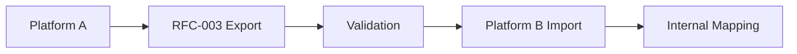

# RFC-003: Specifikacija modela podataka o mišiću

**Status**: Nacrt
**Verzija**: 0.1.0
**Datum**: 2025-09-09
**Autori**: VITNESS tim
**Kategorija**: Standards Track

## Sažetak

Ova specifikacija definiše standardizovani model podataka za informacije o mišićima radi omogućavanja interoperabilnosti i prenosivosti podataka među fitnes aplikacijama i platformama. Ovaj RFC uspostavlja strukturne zahteve za podatke o mišićima, dozvoljavajući platformama da zadrže sopstvene anatomske klasifikacije i taksonomije mišića.

## 1. Uvod

### 1.1. Pozadina

Fitnes aplikacije zahtevaju dosledne definicije mišića za ciljanje vežbama, programiranje treninga i praćenje napretka. Trenutno svaka platforma održava odvojene taksonomije mišića i anatomske klasifikacije, što stvara fragmentaciju podataka i ograničava interoperabilnost.

### 1.2. Ciljevi

Ova specifikacija ima za cilj da:
1. Definiše strukturne zahteve za razmenu podataka o mišićima
2. Omogući neometanu migraciju podataka o mišićima između fitnes aplikacija
3. Podrži anatomske atribute specifične za platformu kroz mehanizme ekstenzija
4. Uspostavi dosledne obrasce identifikacije i klasifikacije mišića
5. Obezbedi referentnu implementaciju JSON šeme za validaciju

### 1.3. Obuhvat

**U obuhvatu:**
- Osnovna struktura podataka o mišićima i obavezna polja
- Klasifikacija mišića uključujući informacije o regionu i lateralnosti
- Mehanizmi ekstenzija za anatomske podatke specifične za platformu
- Definicije JSON šema i pravila validacije
- Reference na medije i dokumentaciju mišića
- Podrška za internacionalizaciju naziva mišića

**Van obuhvata:**
- Konkretne anatomske taksonomije ili medicinske klasifikacije
- Biomehanička analiza i obrasci aktivacije mišića (budući RFC)
- Podaci o povredama i rehabilitaciji
- Merenje aktivacije mišića u realnom vremenu

## 2. Terminologija

- **Mišić**: Anatomsko kontraktilno tkivo koje generiše silu i proizvodi pokret
- **Kanonski podaci**: Standardizovane identifikujuće informacije (naziv, slug, alijasi)
- **Klasifikacija**: Podaci o anatomskoj kategorizaciji (kategorija, region, lateralnost)
- **Region**: Grupisanje po anatomskoj lokaciji (upper-front, lower-back itd.)
- **Lateralnost**: Karakteristika simetrije (bilateral, unilateral, left, right)
- **Ekstenzija**: Podaci specifični za platformu koji ne narušavaju interoperabilnost
- **Verzija šeme**: Semantička verzija koja označava kompatibilnost modela podataka

## 3. Osnovni strukturni zahtevi

### 3.1. Obavezna polja

:::danger MORA
Svi usaglašeni podaci o mišićima **MORAJU** da sadrže ova polja:
:::

```json fds:document entity=muscle
{
  "schemaVersion": "1.0.0",
  "id": "mus.quadriceps",
  "canonical": {
    "name": "Quadriceps",
    "slug": "quadriceps"
  },
  "classification": {
    "categoryId": "cat.legs",
    "region": "lower-front"
  },
  "metadata": {
    "createdAt": "2025-01-01T00:00:00Z",
    "updatedAt": "2025-09-03T00:00:00Z",
    "source": "vitness.registry",
    "status": "active"
  }
}
```

### 3.2. Opciona standardna polja

Uobičajeno podržana opciona polja koja unapređuju interoperabilnost:

```json fds:fragment entity=muscle partial
{
  "canonical": {
    "aliases": ["Quads"],
    "localized": [
      { "lang": "sr", "name": "Kvadriceps" }
    ]
  },
  "classification": {
    "laterality": "bilateral",
    "tags": ["major-muscle", "lower-body"]
  },
  "heatmap": {
    "atlasId": "atlas.body.v1",
    "regions": [
      { "areaId": "thigh.left.anterior", "weight": 1.0 },
      { "areaId": "thigh.right.anterior", "weight": 1.0 }
    ]
  },
  "media": [],
  "attributes": {
    "fiberType": "mixed",
    "size": "large",
    "function": "knee-extension"
  }
}
```

### 3.3. Mehanizmi ekstenzija

Dve tačke proširenja za podatke specifične za platformu:

#### 3.3.1. Atributi (strukturirane ekstenzije)
Za uobičajene ekstenzije koje mogu postati standardizovane:
```json fds:fragment entity=muscle
{
  "attributes": {
    "fiberType": "mixed",
    "size": "large",
    "function": "knee-extension"
  }
}
```

#### 3.3.2. Ekstenzije (specifične za platformu)
Za složene strukture podataka jedinstvene za platformu:
```json fds:fragment entity=muscle
{
  "extensions": {
    "x:anatomy": {
      "origin": "Anterior superior iliac spine, femur",
      "insertion": "Patella, tibial tuberosity",
      "innervation": "Femoral nerve"
    }
  }
}
```

## 4. Referentni tipovi i strukture

### 4.1. Kanonske informacije

`canonical` nosi identitet mišića — prikazni naziv, slug, alijase i lokalizovane nazive. Anatomsko imenovanje je mesto gde alijasi zarađuju svoje mesto: isti mišić je „latissimus dorsi“ za kliničara i „lat“ za sve u teretani, a katalog koji prepoznaje samo jedan od tih naziva podbacuje u polovini svojih pretraga.

```json fds:fragment entity=muscle
{
  "canonical": {
    "name": "Quadriceps",
    "slug": "quadriceps",
    "aliases": ["Quads"],
    "localized": [
      { "lang": "sr", "name": "Kvadriceps" }
    ]
  }
}
```

### 4.2. Struktura klasifikacije

`classification` smešta mišić u katalog. `categoryId` je grupa kategorije mišića kojoj pripada (RFC-004) i ono je što omogućava agregaciju obima po grupi bez tabele za pretragu. `tags` su slobodne oznake koje ne nose nikakvu strukturnu posledicu.

```json fds:fragment entity=muscle
{
  "classification": {
    "categoryId": "cat.legs",
    "region": "lower-front",
    "laterality": "bilateral",
    "tags": ["major-muscle", "lower-body"]
  }
}
```

### 4.3. Regionalna klasifikacija

Polje `region` — u šemi tipa `regionGroup` — prati standardizovane anatomske regione:
- **upper-front**: Grudi, prednji deltoidi, bicepsi
- **upper-back**: Latovi, zadnji deltoidi, romboidi, trapezi
- **lower-front**: Kvadricepsi, pregibači kuka
- **lower-back**: Zadnja loža, gluteusi, erector spinae
- **core**: Trbušni mišići, kosi mišići, transverzus abdominis
- **full-body**: Mišići koji se protežu preko više regiona
- **n/a**: Neprimenljiva ili nedefinisana regionalna klasifikacija

### 4.4. Klasifikacija lateralnosti

Polje `laterality` opisuje karakteristike simetrije:
- **bilateral**: Mišić postoji simetrično na obe strane tela
- **unilateral**: Mišić postoji samo na jednoj strani
- **left**: Mišić specifično leve strane
- **right**: Mišić specifično desne strane
- **n/a**: Neprimenljivo, ili mišići središnje linije

### 4.5. Reference na medije

`media` prati zajedničku definiciju iz RFC-001 — tipično anatomska ilustracija.

```json fds:fragment entity=muscle
{
  "media": [
    {
      "type": "image",
      "uri": "https://cdn.example.com/anatomy/quadriceps.jpg"
    }
  ]
}
```

### 4.6. Toplotna mapa preko atlasa tela

Zapisi mišića MOGU da uključe opcioni objekat `heatmap` koji referencira atlas tela. Atlas tela definiše poglede (npr. anteriorni/posteriorni) i imenovane oblasti vezane za oblike unutar materijala (tipično SVG). Mišići referenciraju te oblasti sa težinama intenziteta da bi omogućili interoperabilnu vizuelizaciju.

Struktura:
```json fds:fragment entity=muscle
{
  "heatmap": {
    "atlasId": "atlas.body.v1",
    "regions": [
      { "areaId": "thigh.left.anterior", "weight": 1.0 },
      { "areaId": "thigh.right.anterior", "weight": 1.0 }
    ]
  }
}
```

Napomene:
- `regions` navodi oblasti atlasa koje ovaj mišić pokriva; svaki unos uparuje `areaId` sa `weight`.
- `atlasId` referencira stavku atlasa (pogledajte šemu Body Atlas) i TREBALO BI da bude UUID u produkcionim skupovima podataka.
- `areaId` MORA da odgovara nekom `areas[*].id` unutar referenciranog atlasa.
- `weight` je `0..1` i predstavlja relativni intenzitet/pokrivenost; podrazumevano `1.0`.
- Konzumenti TREBALO BI da ograniče težine na `[0,1]` i mapiraju ih na skale boje/providnosti po potrebi.

## 5. Verzionisanje i kompatibilnost

### 5.1. Verzionisanje šema

Prema semantičkom verzionisanju:
- **Glavna**: Nekompatibilne izmene obaveznih polja
- **Sporedna**: Nova opciona polja ili vrednosti enuma
- **Zakrpa**: Ažuriranja dokumentacije i validacije

### 5.2. Pravila kompatibilnosti

- Svi podaci važeći u verziji X.Y.Z moraju ostati važeći u X.Y+1.0
- Nova obavezna polja moraju da obezbede razumne podrazumevane vrednosti
- Zastarela polja ostaju funkcionalna tokom cele glavne verzije
- Putanje migracije moraju biti dokumentovane za promene glavne verzije

### 5.3. Primer evolucije šeme

Verzija 1.0.0 → 1.1.0 (dodavanje opcionog biomehaničkog polja):
```json fds:ignore a hypothetical next version illustrating how an optional field arrives; no published muscle schema has biomechanics
{
  "schemaVersion": "1.1.0",
  "id": "mus.quadriceps",
  "canonical": { "name": "Quadriceps", "slug": "quadriceps" },
  "biomechanics": {
    "primaryActions": ["knee-extension", "hip-flexion"],
    "forceDirection": "linear"
  }
}
```

## 6. Smernice za implementaciju

### 6.1. Integracija platformi

Platforme koje implementiraju ovaj standard trebalo bi da:

1. **Održavaju interne modele**: Zadrže postojeće kataloge mišića i anatomske klasifikacije
2. **Izvoze usaglašeno**: Obezbede podatke o mišićima u RFC-003 formatu radi prenosivosti
3. **Prevode pri uvozu**: Mapiraju dolazne RFC-003 podatke na interne strukture
4. **Koriste ekstenzije**: Koriste imenski prostor `extensions` za podatke specifične za platformu

### 6.2. Tok rada migracije podataka



1. Izvorna platforma izvozi mišiće u RFC-003 formatu
2. Validacija podataka prema JSON šemi
3. Odredišna platforma uvozi i mapira na interni model
4. Prilagođene ekstenzije se obrađuju u skladu sa mogućnostima platforme

## 7. Razmatranja bezbednosti i privatnosti

- Ova specifikacija definiše samo format podataka
- Implementacije moraju da validiraju prema JSON šemi
- Sadržaj u ekstenzijama koji generišu korisnici trebalo bi sanitizovati
- Pratite standardne bezbednosne prakse za prenos podataka

## 8. Referenca JSON šeme

Kompletna JSON šema je dostupna na:
- **Muscle**: `/specification/schemas/muscle/v1.0.0/muscle.schema.json`
- **Body Atlas**: `/specification/schemas/atlas/v1.0.0/body-atlas.schema.json`

## 8.1. Validacija

Validirajte pomoću Ajv (Draft 2020-12):

```
npx --package=ajv-cli --package=ajv-formats ajv validate --spec=draft2020 -c ajv-formats \
  -s specification/schemas/muscle/v1.0.0/muscle.schema.json \
  -d specification/schemas/muscle/v1.0.0/muscle.example.json
```

## 9. Primer implementacije

### 9.1. Kompletan zapis mišića kvadricepsa

Na osnovu referentne implementacije (`/specification/schemas/muscle/v1.0.0/muscle.example.json`):

```json
{
  "schemaVersion": "1.0.0",
  "id": "mus.quadriceps",
  "canonical": { 
    "name": "Quadriceps", 
    "slug": "quadriceps",
    "aliases": ["Quads"],
    "localized": [
      { "lang": "sr", "name": "Kvadriceps" }
    ]
  },
  "classification": { 
    "categoryId": "cat.legs", 
    "region": "lower-front", 
    "laterality": "bilateral"
  },
  "heatmap": {
    "atlasId": "atlas.body.v1",
    "regions": [
      { "areaId": "thigh.left.anterior", "weight": 1.0 },
      { "areaId": "thigh.right.anterior", "weight": 1.0 }
    ]
  },
  "media": [],
  "attributes": {
    "fiberType": "mixed",
    "size": "large",
    "function": "knee-extension"
  },
  "extensions": {
    "x:anatomy": {
      "origin": "Anterior superior iliac spine, femur",
      "insertion": "Patella, tibial tuberosity",
      "innervation": "Femoral nerve"
    }
  },
  "metadata": {
    "createdAt": "2025-01-01T00:00:00Z",
    "updatedAt": "2025-09-03T00:00:00Z",
    "source": "vitness.registry",
    "status": "active"
  }
}
```

### 9.2. Mapiranje uvoza na platformi (TypeScript primer)

```typescript
interface RFC003Muscle {
  schemaVersion: string;
  id: string;
  canonical: {
    name: string;
    slug: string;
    aliases?: string[];
    localized?: Array<{
      lang: string;
      name: string;
      aliases?: string[];
    }>;
  };
  classification: {
    categoryId: string;
    region: "upper-front" | "upper-back" | "lower-front" | "lower-back" | "core" | "full-body" | "n/a";
    laterality?: "left" | "right" | "bilateral" | "unilateral" | "n/a";
    tags?: string[];
  };
  attributes?: Record<string, any>;
  extensions?: Record<string, any>;
  metadata: {
    createdAt: string;
    updatedAt: string;
    source: string;
    status: string;
  };
}

// Platform-specific import mapping
function importMuscle(rfc003Data: RFC003Muscle) {
  const muscle = {
    id: rfc003Data.id,
    name: rfc003Data.canonical.name,
    slug: rfc003Data.canonical.slug,
    aliases: rfc003Data.canonical.aliases || [],
    categoryId: rfc003Data.classification.categoryId,
    region: rfc003Data.classification.region,
    laterality: rfc003Data.classification.laterality,
    tags: rfc003Data.classification.tags || [],
    attributes: rfc003Data.attributes || {}
  };

  // Handle anatomical extensions
  if (rfc003Data.extensions?.['x:anatomy']) {
    muscle.anatomy = rfc003Data.extensions['x:anatomy'];
  }

  return muscle;
}
```

## 10. Reference

## Usaglašenost

**Usaglašeni proizvođači podataka:**

:::danger MORA
- **MORAJU** da emituju JSON koji se validira prema šemi Muscle za deklarisani `schemaVersion`.
- **MORAJU** da koriste UUIDv4 za sve identifikatore u produkcionim podacima (npr. `id` mišića). Kratki primeri ID-jeva u ovom RFC-u su samo ilustrativni.
- **MORAJU** da popune sva obavezna polja i poštuju enumeracije i strukturu.
:::

:::tip TREBALO BI
- **TREBALO BI** da uključe RFC 3339 UTC vremenske oznake u `metadata`.
:::

**Usaglašeni konzumenti:**

:::danger MORA
- **MORAJU** da validiraju dolazne podatke o mišićima prema odgovarajućoj verziji šeme.
- **MORAJU** da ignorišu nepoznate ključeve u `attributes` i `extensions`.
:::

:::tip TREBALO BI
- **TREBALO BI** da tolerišu dodatna opciona polja uvedena u novijim sporednim verzijama.
- **TREBALO BI** da odbace podatke kojima nedostaju obavezna polja ili imaju nevažeće enumeracije.
:::

**Kompatibilnost:**

:::danger MORA
- Opciona polja dodata u sporednim verzijama **NE SMEJU** da naruše konzumente; konzumenti **TREBALO BI** da ignorišu nepoznata opciona polja.
- Nova obavezna polja su izmena **GLAVNE** verzije i zahtevaju koordinisane nadogradnje.
:::

---

Dodatni resursi:
- Politika identifikatora i UUID-a: `/specification/README.md#identifiers-ids`
- Konvencije za i18n i slugove: `/specification/i18n-and-slugs.md`
- Politika ekstenzija i vodič za registar: `/specification/extension-registry.md`


### 10.1. Normativne reference
- [JSON Schema Draft 2020-12](https://json-schema.org/draft/2020-12/schema)
- [RFC 3339: Date/Time](https://tools.ietf.org/html/rfc3339)
- [RFC-001: Specifikacija modela podataka o vežbi](./rfc-001-exercise-data-model.md)
- [RFC-002: Specifikacija modela podataka o opremi](./rfc-002-equipment-data-model.md)
 - [RFC-005: Specifikacija modela podataka o atlasu tela](./rfc-005-body-atlas-data-model.md)

### 10.2. Informativne reference
- Standardi anatomske terminologije
- Sistemi klasifikacije mišića u nauci o vežbanju
- Baze podataka o biomehaničkoj funkciji mišića

---

Obaveštenje o autorskim pravima  
Copyright (c) 2025 VITNESS.
Ovaj dokument podleže pravima, licencama i ograničenjima sadržanim u dokumentu VITNESS Open Standards License Agreement. Pogledajte `/specification/VITNESS Open Standards License Agreement.md`.

## Smernice za konzumente (agregacija toplotnih mapa)

Konzumenti MOGU da agregiraju toplotne mape više mišića radi vizuelizacije (npr. za prikaz vežbe ili treninga). Kombinujte oblasti po `areaId` unutar istog `atlasId` koristeći ili:
- Maks agregaciju: `weight = max(weights)` (jednostavna i stabilna), ili
- Normalizovani zbir sa gornjom granicom: `weight = min(1.0, sum(weights))` (naglašava preklapanje).

Kada podaci referenciraju različite atlase, agregirajte odvojeno po `atlasId`. Sistemi za prikaz TREBALO BI da obezbede razumne podrazumevane vrednosti za skale boja i mapiranje providnosti.
